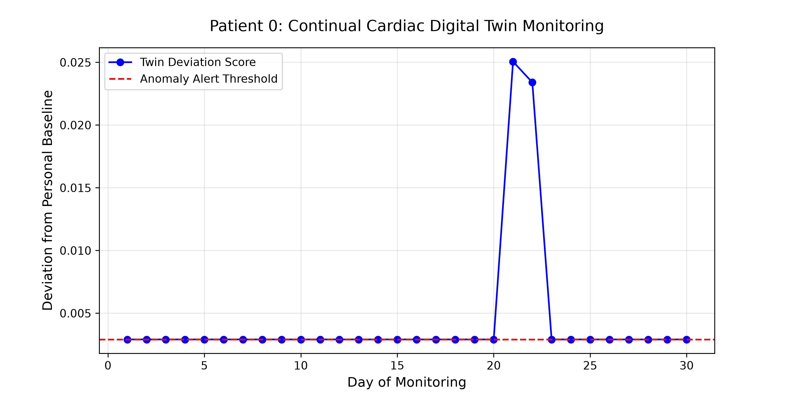

# 🫀 ContinualTwin: Personalized Cardiac Digital Twin

**Team 38:** Kaki Hemavardhan, Pamu Praneeth Kumar, Naru Nikhith Reddy


### 🏆 Track 5: Continual Learning Adaptation from Population to Individual

ContinualTwin is a healthcare AI platform that solves **Catastrophic Forgetting** when personalizing wearable health monitors. 

## 🚨 The Problem
When a global Foundation Model (trained on thousands of patients) is fine-tuned to monitor a *single* patient's smartwatch ECG, it suffers from Catastrophic Forgetting. It perfectly memorizes the new patient, but entirely forgets what a general heart attack looks like in other demographics. 

## 💡 Our Solution
We implemented **Elastic Weight Consolidation (EWC)** to create a "Digital Twin". 
By calculating a Fisher Information Matrix during population training, our Continual Learning engine locks the critical neural weights. This allows the model to adapt perfectly to the individual patient *without* destroying its foundational medical knowledge.

---

## 📊 Performance & Results
We trained a 1D ResNet on **21,800 patients** from the PTB-XL clinical database, and then continually adapted it to Patient 0. 

| Adaptation Strategy | Patient Accuracy (Personalization) | Population Retention (Forgetting) |
| :--- | :--- | :--- |
| **Base Model** (No adaptation) | N/A | **87.09%** |
| **Naive Fine-Tuning** | 100.0% | 73.88% 🔻 *(Severe Forgetting)* |
| **Experience Replay** | 100.0% | 86.72% ➖ |
| **EWC (ContinualTwin)** | **100.0%** | **84.89%** 🟢 *(Preserved!)* |

Our EWC algorithm successfully retained ~85% of the foundation model's general knowledge while achieving 100% personalization for the patient's Digital Twin.

## 📉 Real-Time Anomaly Detection
Once the Digital Twin is created, it monitors the patient's incoming ECG stream. Below is our system successfully detecting a massive cardiac deviation on Day 21:



---

## 🚀 How to Run (One-Command End-to-End)
This repository satisfies the hackathon reproducibility rules (Seed=42 locked). To run the entire pipeline end-to-end (data parsing, model training, graph generation, and dashboard launching), simply execute the batch script:

```bash
run.bat
```

*(Note: Ensure `torch torchvision pandas wfdb streamlit plotly numpy pyyaml` are installed first).*

## 📁 Project Structure
```text
ContinualTwin/
├── app.py                  # Streamlit Interactive Dashboard
├── main.py                 # Core Continual Learning Training Loop
├── demo_anomaly.py         # Script to generate Anomaly Detection Graphs
├── config.yaml             # Hyperparameter configuration
├── run.bat                 # One-Click execution script for Judges
├── Report.md               # 4-Page Academic Report
├── README.md               # Project documentation
├── assets/                 # Images and media for documentation
│   └── anomaly_demo.png
└── src/
    ├── model.py            # 1D ResNet Neural Network Architecture
    ├── ewc.py              # Elastic Weight Consolidation (Fisher Matrix) Algorithm
    ├── replay_buffer.py    # Experience Replay baseline implementation
    ├── dataset.py          # PyTorch Dataloaders and Train/Val/Test Split
    ├── anomaly_detection.py# Cosine Similarity inference logic
    └── process_local_data.py # WFDB Parser for the massive PTB-XL ECG dataset
```
